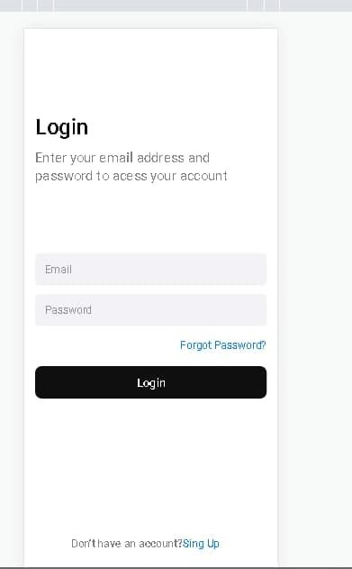

# Confira a aplicação <a href="https://dev-pedrosv.github.io/Projeto-Interface-Login/">AQUI.</a>

# Login Interface

> Interface do projeto finalizado

### Ajustes e melhorias

O projeto ainda está em desenvolvimento e as próximas atualizações serão voltadas nas seguintes tarefas:

- [x] Criação HTML
- [x] Criação CSS
- [ ] Melhoria de layout
- [ ] Adicionar botões Logins com Redes Sociais

## 🤝 Colaboradores

Agradecemos às seguintes pessoas que contribuíram para este projeto:

<table>
  <tr>
    <td align="center">
      <a href="#">
         
        
          <b>Pedro Silva</b>
        
      </a>
    </td>
    
  </tr>
</table>

